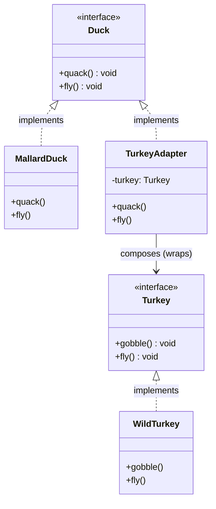

# Adapter Pattern
## Problem That the Adapter Solves

Imagine you're a game developer building a duck simulator. Your code expects **ducks** everywhere: they all implement a `Duck` interface with `quack()` and `fly()`. Everything's quacking along fine... until you run out of ducks. But you have a ton of **turkeys** from another library! Turkeys don't quack — they gobble. And they fly, but only in short bursts, not like ducks.

Without the Adapter Pattern, you'd have to:
- Rewrite your simulator to handle turkeys separately (duplicate code, violates DRY).
- Hack the turkey class to add duck methods (but you can't — it's a third-party library, and modifying it breaks OCP).
- Or worse, scatter "if it's a turkey, do this instead" checks everywhere (spaghetti code, hard to maintain).

This is the classic **interface mismatch** problem. Adapters solve it by **wrapping** the incompatible object (turkey) to make it look like the expected one (duck). No changes to existing code — your simulator just sees "ducks" everywhere. The book uses this to show how adapters handle legacy systems, third-party APIs, or any time two incompatible interfaces need to work together (like old Enumerations in Java vs. modern Iterators).

## What Is the Adapter Pattern

### Definition
The **Adapter Pattern** converts the interface of a class into another interface the clients expect. Adapter lets classes work together that couldn't otherwise because of incompatible interfaces.

In Head-First speak: It's like a "translator" or "wrapper" that makes one object speak the language of another. The client (your duck simulator) talks to the **Target** interface (`Duck`). The **Adapter** (`TurkeyAdapter`) implements that target and delegates calls to the **Adaptee** (`Turkey`), translating as needed (gobble → quack, short fly ×5 → long fly).

Key players:
- **Client**: Uses the Target interface (e.g., `testDuck()` function).
- **Target**: The interface you want (e.g., `Duck`).
- **Adaptee**: The incompatible class you have (e.g., `Turkey`).
- **Adapter**: Implements Target, wraps Adaptee, and translates calls.

It's a structural pattern from the Gang of Four.

### Pros
- **Integration without modification**: Reuse existing classes (like third-party turkeys) without changing them — follows OCP.
- **Decoupling**: Client doesn't know about the adaptee; it just sees the target interface.
- **Flexibility**: Easily swap adapters for different adaptees (e.g., adapt a goose next).
- **Single Responsibility**: Adapter handles translation in one place, not scattered.
- **Two-way if needed**: You can make a DuckAdapter for the reverse (duck acting as turkey).

Cons (for balance, like the book says): Can add a layer of indirection, which might slightly hurt performance if overused. But usually worth it!

## Architecture of the Pattern

Here's the UML class diagram for the Adapter Pattern in Mermaid syntax (paste into https://mermaid.live for instant viewing). It's straight from the book's style, using our duck/turkey example.

This shows the **object adapter** (using composition) — the common one in TypeScript/Java since we don't have multiple inheritance.

## What Is Object Adapter and Class Adapter

At the end of the Adapter section, the book explains two flavors:

- **Object Adapter**: Uses **composition** (has-a relationship). The adapter holds a reference to the adaptee and delegates calls to it. This is what we implemented in our TypeScript code (`TurkeyAdapter` has a `private turkey: Turkey`). Pros: Flexible, works in languages without multiple inheritance (like TS/Java). You can adapt subclasses easily. Cons: Can't override adaptee behavior directly (but you can in the adapter methods).

- **Class Adapter**: Uses **multiple inheritance** (is-a for both Target and Adaptee). The adapter subclasses both the Target and Adaptee, overriding methods as needed. Pros: Can override adaptee methods easily. Cons: Requires multiple inheritance, which isn't supported in TypeScript or Java (but possible in C++ or Python). Less flexible for adapting interfaces.

The book prefers **object adapters** for most OO languages — that's why our example uses it. (Fun fact: In Java, the Enumeration-to-Iterator adapter is an object adapter.)

## Difference Between the Adapter and Decorator Pattern

The book has a whole "There Are No Dumb Questions" on this because they look similar (both wrap objects). But they're solving different problems:

- **Adapter**: Changes the **interface** to match what the client expects. It's about compatibility (e.g., making a turkey quack like a duck). The client sees a different interface than the adaptee provides. No added behavior — just translation. (Wraps to convert.)

- **Decorator**: Enhances or adds **behavior** without changing the interface. It's about responsibilities (e.g., adding whipped cream to coffee in Starbuzz — still a Beverage). The client sees the **same** interface. You can stack multiple decorators. (Wraps to decorate.)

In code: Adapter implements a *new* interface; Decorator implements the *same* interface as the wrapped object.

Example: If you have a `Coffee` (Beverage interface), a Decorator adds mocha (still Beverage). But if you have a `Tea` with a different interface, an Adapter makes it look like a Beverage.

Adapter = "Interface converter." Decorator = "Behavior enhancer."