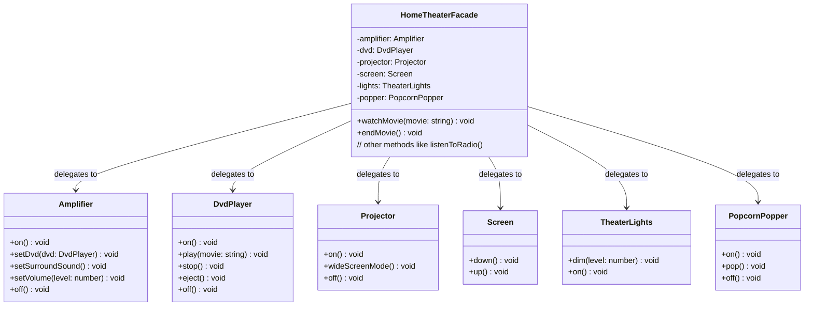

# Facade Pattern
## Problem 

Picture this: You've got a killer home theater setup — amplifier, DVD player, projector, screen, lights, popcorn popper. To watch a movie, you have to juggle a million steps: turn on the amp, set input to DVD, crank the volume; power up the DVD player, insert disc, play; lower the screen; dim the lights; start the popper... and don't forget to reverse it all when done!

Without Facade, your client code (like a remote app) gets bloated and tightly coupled to every subsystem. Adding a new device? Rewrite everything. One change in a component (e.g., amp API updates)? Boom, your code breaks. This violates OCP (hard to extend) and creates a maintenance nightmare — you're talking to *every* class directly, leading to dependencies galore.

Facades solve this by providing a **unified, simplified interface** to a complex subsystem. Your client just says "watchMovie()" — the facade handles the orchestration behind the scenes. It's perfect for legacy systems, third-party libraries, or any tangled web of classes (like APIs or hardware integrations).

## Definition of the Facade Pattern

The **Facade Pattern** provides a unified interface to a set of interfaces in a subsystem. Facade defines a higher-level interface that makes the subsystem easier to use.

In Head-First terms: It's like a "simplifier" or "front door" that hides the complexity. The client talks only to the Facade, which delegates to the subsystem classes (e.g., `HomeTheaterFacade` calls methods on Amp, DVD, Projector, etc.). It's not about adding functionality — it's about making existing stuff *easier* without changing it.

Key players:
- **Facade**: The simple interface (e.g., `HomeTheaterFacade` with `watchMovie()`, `endMovie()`).
- **Subsystem Classes**: The complex bits (e.g., `Amplifier`, `DvdPlayer`, `Projector`).
- **Client**: Uses the facade without knowing the subsystems.

It's a structural pattern that promotes loose coupling.

## Architecture of the Pattern

Here's a Mermaid class diagram for the Facade Pattern, based on the book's Home Theater example. Paste this into https://mermaid.live to see it live!



## Pros of the Facade Pattern

- **Simplifies complexity**: Clients get a clean, easy API — no need to learn the subsystem's ins and outs.
- **Decoupling**: Clients depend only on the facade, not the subsystems. Change subsystems? Clients unaffected (OCP win!).
- **Layering**: You can add facades for subsystems within subsystems, building hierarchies.
- **Reusability**: Facades make subsystems portable and testable in isolation.
- **Flexibility**: Still access subsystems directly if needed (facade doesn't block them).
- **Reduces errors**: Fewer steps for clients mean less chance of misuse.

Cons: Might hide too much if overused, or add unnecessary layers in simple systems.

## Design Principle: Principle of Least Knowledge - Talk Only to Your Immediate Friends

This principle (aka Law of Demeter) is the star of the Facade chapter! It says: **Only talk to your immediate friends.** Don't reach deep into object graphs — it creates tight coupling and fragility. If Object A needs data from Object C (via B), don't let A call B.getC().getData(). Instead, add a method to B that handles it.

Facades embody this: The client "friends" only the facade, which friends the subsystems. This minimizes dependencies — if a subsystem changes, only the facade updates.

## How NOT to Win Friends and Influence Objects

Alright, but how do you avoid messing this up? The principle gives clear rules: For any object, in any of its methods, you should only call methods on:
- The object itself.
- Objects passed in as parameters to the method.
- Any objects that the method creates or instantiates.
- Any components (instance variables) of the object.

Here's a bad example violating the principle:

```java
public float getTemp() {
    Thermometer thermometer = station.getThermometer();
    return thermometer.getTemperature();
}
```

In this code, we're grabbing the thermometer from the station and directly asking it for the temperature — that's digging too deep!

Now, applying the principle:

```java
public float getTemp() {
    return station.getTemperature();
}
```

By adding a `getTemperature()` method to the Station class, it handles the request to the thermometer internally. This cuts down on the classes we're directly dependent on.

Check out this Car class example that follows the Principle of Least Knowledge perfectly in all its method calls:

```java
public class Car {
    Engine engine; // other instance variables

    public Car() {
        // initialize engine, etc.
    }

    public void start(Key key) {
        Doors doors = new Doors();
        boolean authorized = key.turns();
        if (authorized) {
            engine.start();
            updateDashboardDisplay();
            doors.lock();
        }
    }

    public void updateDashboardDisplay() {
        // update display
    }
}
```

- Here, we're instantiating a new object (Doors), so calling its methods is fine.
- You can invoke methods on objects passed as parameters (like the Key).
- Calling local methods within the same object (like updateDashboardDisplay()) is allowed.
- You can call methods on objects you create or instantiate (Doors again).
- And you can invoke methods on components of the object (like the Engine instance variable).