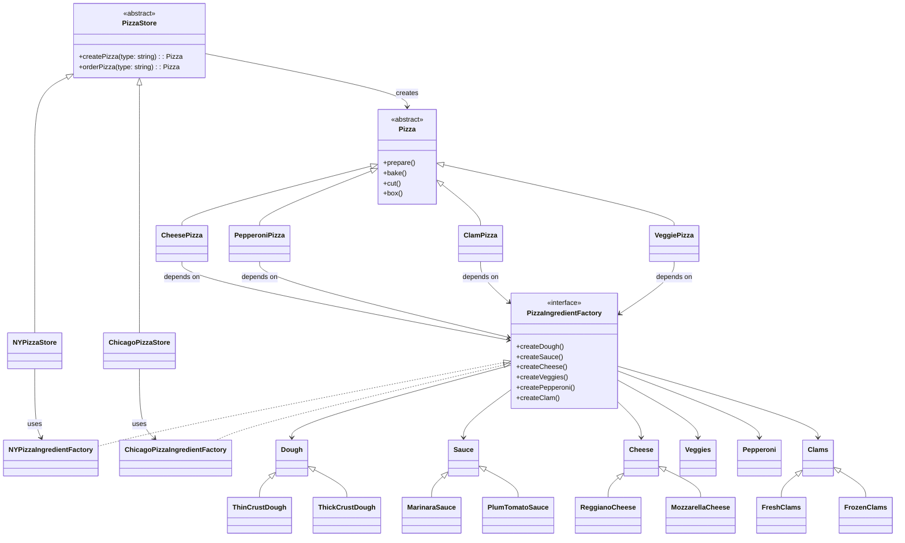

## Overview

Imagine you’re building **a global pizza chain** with stores in **New York**, **Chicago**, and **California**.

Each location makes:
- **Different pizza styles** (thin, deep dish, etc.)
- **Different ingredients** (fresh clams vs frozen, marinara vs plum tomato)

But **all stores follow the same process**:  
`prepare → bake → cut → box`

This project shows **how to design this system** using **real-world design patterns**.

---

## Design Patterns Explained

---

### 1. **Simple Factory** (Not a GoF Pattern)

> **"A helper method that creates objects."**

#### Code
```ts
class SimplePizzaFactory {
  createPizza(type: string): Pizza {
    if (type === "cheese") return new CheesePizza();
    if (type === "clam")   return new ClamPizza();
    // ...
  }
}
```

#### Use Case
```ts
const factory = new SimplePizzaFactory();
const pizza = factory.createPizza("cheese");
```

#### Pros
- Encapsulates object creation.
- Clean and simple.

#### Cons
- **Not extensible** — to add **NY style**, you **modify** the factory.
- **Violates Open/Closed Principle** (OCP).

> **Good for prototypes. Not for real systems.**

---

### 2. **Factory Method** (GoF Pattern)

> **"Let subclasses decide which object to create."**

#### Key Idea
- `PizzaStore` has an **abstract** `createPizza()` method.
- Each **store subclass** decides what pizza to make.

#### Code
```ts
abstract class PizzaStore {
  abstract createPizza(type: string): Pizza;

  orderPizza(type: string): Pizza {
    const pizza = this.createPizza(type);
    pizza.prepare();
    pizza.bake();
    pizza.cut();
    pizza.box();
    return pizza;
  }
}
```

```ts
class NYPizzaStore extends PizzaStore {
  createPizza(type: string): Pizza {
    if (type === "cheese") return new NYStyleCheesePizza();
    // ...
  }
}
```

#### Why It’s Better
| Simple Factory | Factory Method |
|----------------|----------------|
| One factory | **One per store** |
| Modify to extend | **Extend** to add stores |
| Violates OCP | **Follows OCP** |
| No framework | **Reusable `orderPizza()`** |

---

### 3. **Abstract Factory** (GoF Pattern)

> **"Create families of related objects without specifying concrete classes."**

#### Problem
> NY: `Thin Crust + Marinara + Reggiano + Fresh Clams`  
> Chicago: `Thick Crust + Plum Tomato + Mozzarella + Frozen Clams`

→ We need **ingredient families**.

#### Solution
```ts
interface PizzaIngredientFactory {
  createDough(): Dough;
  createSauce(): Sauce;
  createCheese(): Cheese;
  createVeggies(): Veggies[];
  createPepperoni(): Pepperoni;
  createClam(): Clams;
}
```

#### Concrete Factories
| Factory | Dough | Sauce | Cheese | Clams |
|--------|-------|-------|--------|-------|
| `NYPizzaIngredientFactory` | `ThinCrustDough` | `MarinaraSauce` | `ReggianoCheese` | `FreshClams` |
| `ChicagoPizzaIngredientFactory` | `ThickCrustDough` | `PlumTomatoSauce` | `MozzarellaCheese` | `FrozenClams` |

---

### 4. **Dependency Inversion Principle (DIP)**

> **"High-level modules should not depend on low-level modules. Both should depend on abstractions."**

#### Applied Here

| High-Level | Depends On | Low-Level |
|-----------|-----------|----------|
| `CheesePizza` | `PizzaIngredientFactory` (interface) | `NYPizzaIngredientFactory` |

```ts
class CheesePizza extends Pizza {
  constructor(private factory: PizzaIngredientFactory) {
    super();
  }

  prepare() {
    this.dough = this.factory.createDough();  // No concrete class!
    this.sauce = this.factory.createSauce();
    this.cheese = this.factory.createCheese();
  }
}
```

#### Result
- `Pizza` classes **don’t know** NY or Chicago exist.
- Swap factories → change ingredients **without changing pizza logic**.

---

## Full Architecture (UML Diagram)



---

## Key Takeaways

| Pattern | Purpose | OCP? | DIP? | GoF? |
|-------|--------|-----|-----|-----|
| **Simple Factory** | Quick object creation | No | No | No |
| **Factory Method** | Subclasses decide | Yes | Yes | Yes |
| **Abstract Factory** | Families of objects | Yes | Yes | Yes |
| **DIP** | Depend on abstractions | Yes | Yes | Principle |

> **You now have a scalable, maintainable, real-world system.**

---